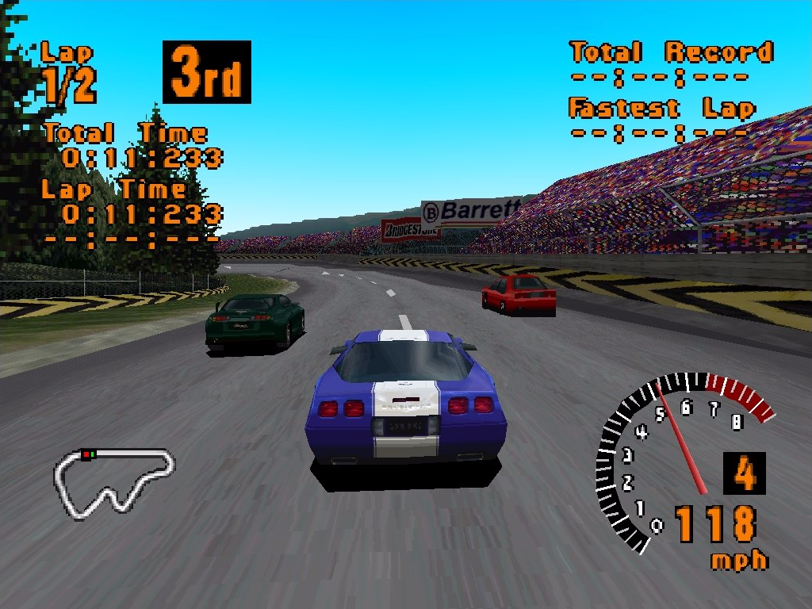
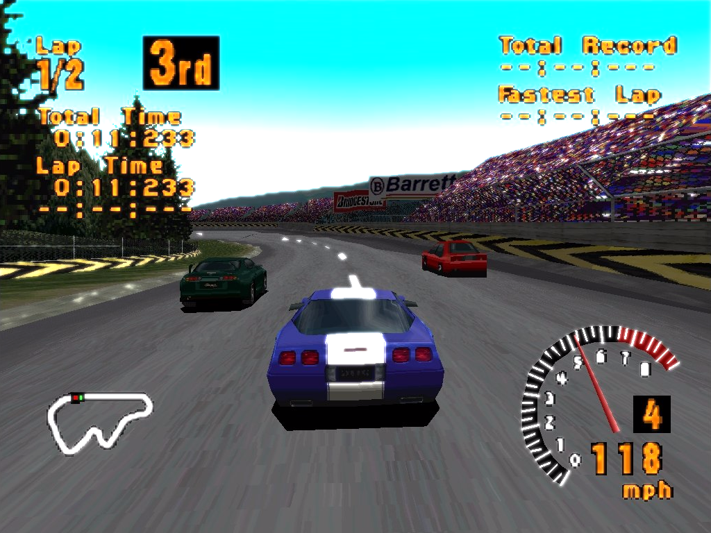
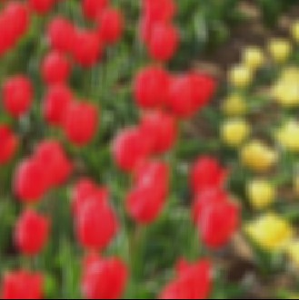

# This code can add bloom and blur effects to any image.

Using OpenCV this code can perform various levels of change in images as follows:
Original image: 
 
Using Bloom Effect: 
 

Using Blur effect: 
Original: 
 
With Blur: 
 

You can also change some parameters to get different results.
